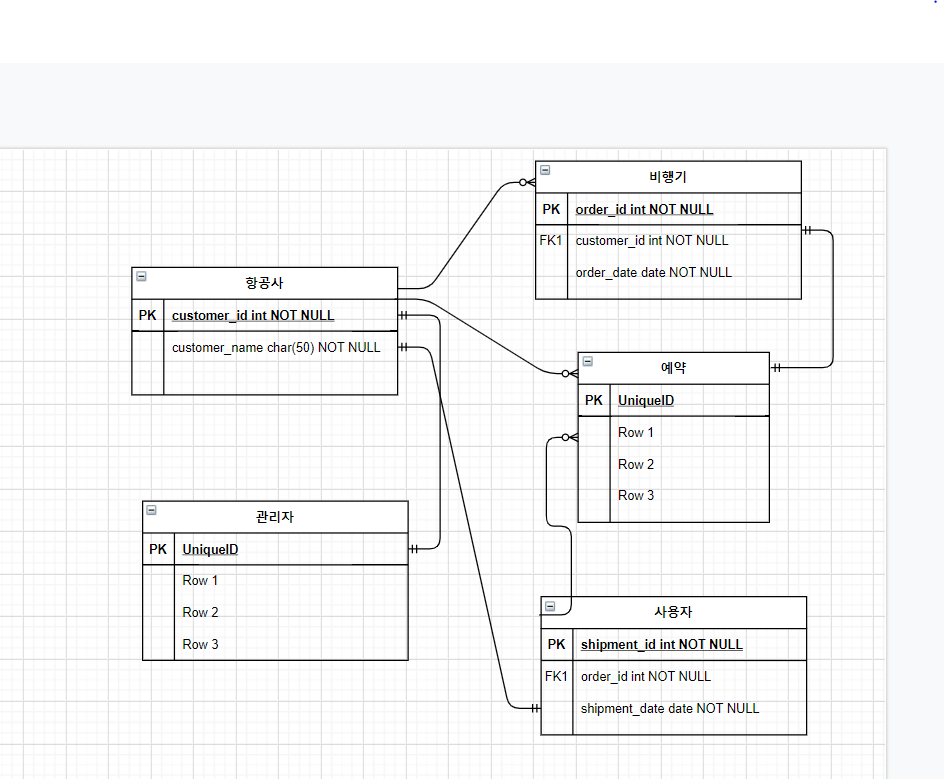
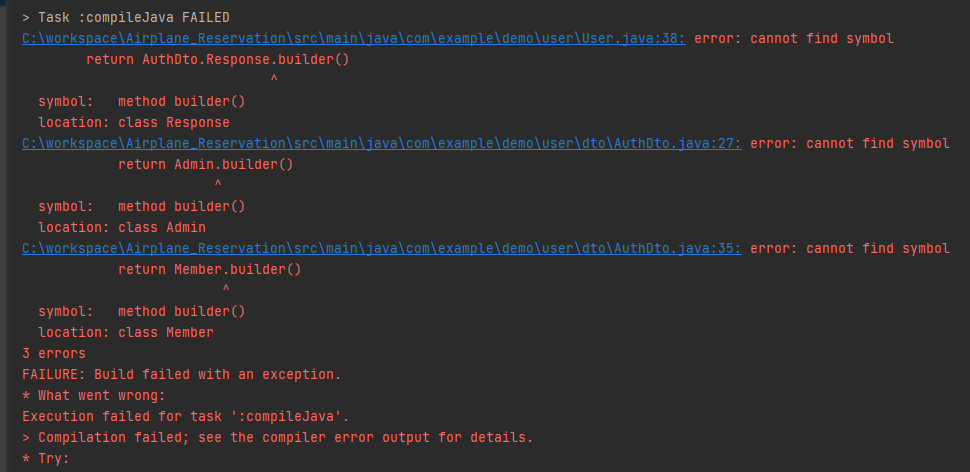
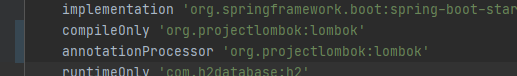
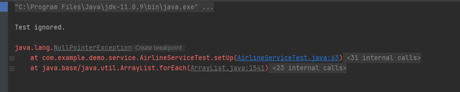
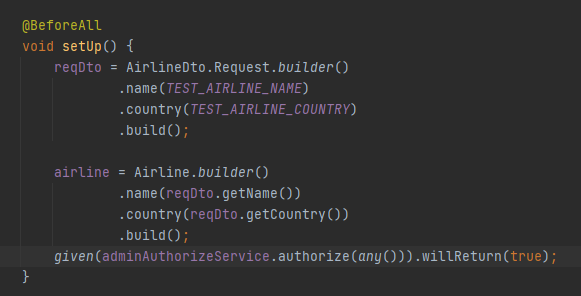
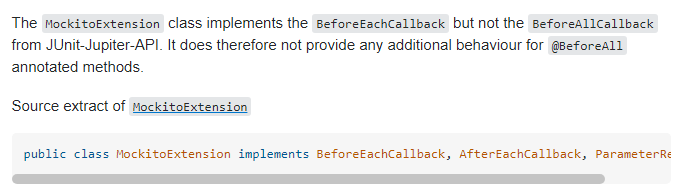
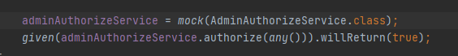

# Airplane_Reservation

## 요구사항
- 항공사와 사용자가 존재한다
- 유저는 아이디 비밀번호 유저등급 권한을 가지고 있어야한다
- 비행기는 목적지 출발지 남은 좌석 좌석 등급을 가격 포함해야한다
- 사용자는 특정 비행기의 특정 좌석을 예약할 수 있다
- 유저는 예약을 취소할 수 있다
- 예약한 표에서 결제를 진행할 수 있다
- 결제한 목록을 가지고 특정 조건을 만족한다면 유저의 등급을 정해줄 수 있다
- 유저는 특정 항공사의 항공편을 조회할 수 있다
- 관리자는 특정 항공사의 항공편을 등록 삭제 수정이 가능하다

## 기술 스택
- Spring boot
- Spring MVC
- Spring Data JPA

## Entity별 Column
항공사 - 이름
        국적
        
비행기 - 이름
        이륙시간 착륙시간  (Temporal)
        이륙지 착륙지 Place (Enum)
        PlaneType enum
        좌석

예약 - 결제수단

사용자 - 등급 enum
        id,pw

## 비행기 안에 있는것?
비행기
대한항공
747 - 이름
3/10 12시 - 이륙시간
3/10 17시 - 도착시간
서울 - 이륙지
싱가포르 - 도착지
보잉747 - 비행기 타입
좌석등급 - 퍼스트클라스

서브타입(Seat)
Booked UnBooked
그안에 좌석등급

가격은 등급마다 enum

## 만드는 순서
관리자 -> 사용자 -> 항공사 -> 비행기 -> 예약
    (join)           		

## ERD

# 트러블 슈팅

빌더 메소드가 컴파일타임에 오류 발생
-> lombok 설정이 build.gradle에 잘못되어 있었다.

서비스 유닛테스트 도중 초기화부분에서 NullPointerException이 발생

-> Mockito는 BeforeAll에서 초기화를 지원하지 않음 명시적 초기화가 필요

