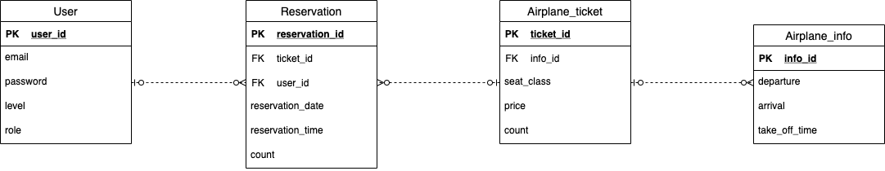

# Airplane_Reservation

## 요구사항
- 항공사와 사용자가 존재한다
- 유저는 아이디 비밀번호 유저등급 권한을 가지고 있어야한다
- 비행기는 목적지 출발지 남은 좌석 좌석 등급을 가격 포함해야한다
- 사용자는 특정 비행기의 특정 좌석을 예약할 수 있다
- 유저는 예약을 취소할 수 있다
- 예약한 표에서 결제를 진행할 수 있다
- 결제한 목록을 가지고 특정 조건을 만족한다면 유저의 등급을 정해줄 수 있다
- 유저는 특정 항공사의 항공편을 조회할 수 있다
- 관리자는 특정 항공사의 항공편을 등록 삭제 수정이 가능하다

## 기술 스택
- Spring boot
- Spring MVC
- Spring Data JPA

## ER Diagram

## Class Diagram
